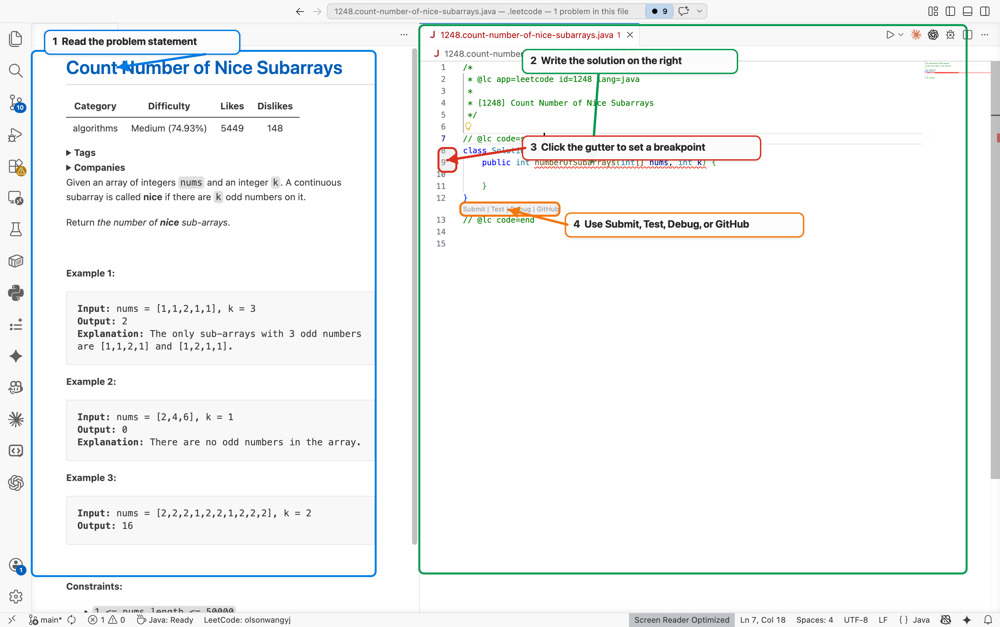
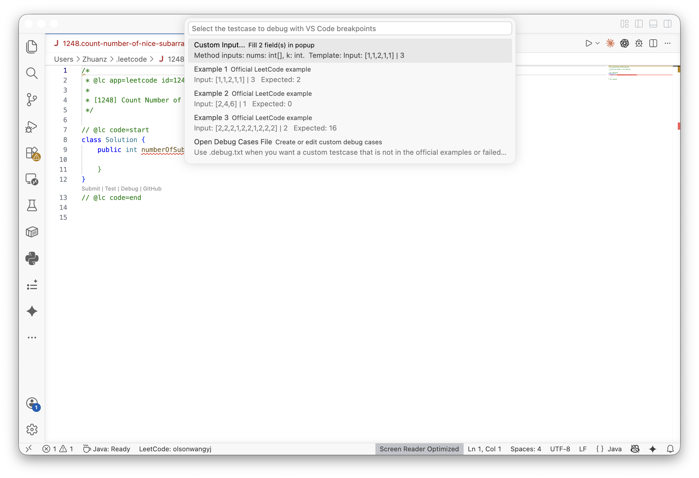

# LeetCode on VSCode

Solve LeetCode problems without leaving VS Code: browse problems, keep the description beside your code, track solving time, run direct tests, submit solutions, upload accepted files to GitHub, and debug Java answers with real VS Code breakpoints.

The numbered screenshot shows the main GUI workflow: read the problem, write the solution, set breakpoints, then use the editor actions.



## Highlights

- Browse, search, preview, and open LeetCode problems from the Activity Bar.
- Keep the problem description on the left and the solution file on the right.
- Run direct tests from the editor toolbar, editor context menu, Explorer context menu, or Command Palette.
- Debug Java solutions with VS Code breakpoints from the `Debug in VS Code` button.
- Track the current problem with an automatic status bar timer, a live top-of-file timer badge, a `Timer` CodeLens, and an editor title timer button.
- Save reusable custom cases in a sibling `.debug.txt` file and compare expected output.
- Replay official examples, failed submission cases, saved debug cases, or one-off custom input.
- Submit to LeetCode and upload solution files to a GitHub repository from VS Code.

## Requirements

- VS Code `1.57.0` or newer.
- A LeetCode account.
- Node.js available to VS Code. If VS Code cannot find Node, set `leetcode.nodePath` to the full Node executable path.
- Java debugging needs a JDK with `javac` plus the VS Code Java Debugger. The extension can guide you to install the Java Extension Pack, the Java Debugger, or a JDK on first use.

## Quick Start: GUI

1. Open VS Code and install `LeetCode on VSCode` from the Extensions view.
2. Click the LeetCode icon in the Activity Bar.
3. Use the globe icon if you need to switch between `leetcode.com` and `leetcode.cn`.
4. Click Sign In, complete the login flow, and wait for the Problems tree to load.
5. Open a problem from the Problems tree or use `LeetCode Companion: Search Problem`.
6. Use the editor actions above your solution file: `Submit | Test | Debug | Timer | GitHub`.

In the screenshot above, `1` is the problem statement, `2` is the solution editor, `3` is the breakpoint gutter, and `4` is the editor action row.

Most daily work can stay in the editor. Right-click a solution file or open the Command Palette (`Cmd+Shift+P` on macOS, `Ctrl+Shift+P` on Windows/Linux) and type `LeetCode Companion` to see the same actions.

## Problem Timer

Open a LeetCode problem and the timer starts automatically. The status bar shows the elapsed time for the active problem file.

The current elapsed time is rendered near `@lc code=start` as a live `Timer 00:00:00` badge, so it keeps updating while you type. Click the editor title timer button, the `Timer 00:00:00` CodeLens near the top of the solution file, the status bar timer, or run `LeetCode Companion: Show Problem Timer` to pause, resume, reset, stop, or copy the elapsed time.

When a submission is accepted, the timer stops by default and shows the final solving time. You can change this behavior in Settings:

```json
{
  "leetcode.problemTimer.enabled": true,
  "leetcode.problemTimer.stopOnAccepted": true
}
```

## Debug Java With Breakpoints

Open a Java solution, set a breakpoint, then click `Debug in VS Code` in the editor title bar or the `Debug` CodeLens inside the file.



When you start debugging, choose one of these inputs:

- `Custom Input...`: enter method arguments one field at a time.
- `Example 1`, `Example 2`, and so on: official examples parsed from the problem description.
- `Failed Case`: cases saved from failed submissions.
- `Saved Debug Case`: cases stored in the `.debug.txt` file.
- `Open Debug Cases File`: create or edit reusable custom cases.

Java debug runs in an isolated runtime under `~/.leetcode/.debug-runtime`, so VS Code attaches to the current problem instead of reusing another problem's `Solution.class`.

## Save Debug Cases

Run `LeetCode Companion: Open Debug Cases File` from the Command Palette, the editor context menu, or the debug picker. The extension creates a file next to your solution, such as:

```text
1248.count-number-of-nice-subarrays.debug.txt
```

Use this format:

```text
Input:
[1,1,2,1,1]
3

Output:
2

---

Input:
[2,4,6]
1

Output:
0
```

Separate cases with `---`. `Input` is required. `Output` is optional, and when present the extension compares it with the actual result.

## Install From Command Line

Install the Marketplace extension with the VS Code CLI:

```bash
code --install-extension olsonwangyj.leetcode-on-vscode
```

Install a local `.vsix` package:

```bash
code --install-extension leetcode-on-vscode-1.0.6.vsix
```

Open VS Code in the folder where you want LeetCode files to be created:

```bash
code .
```

The VS Code CLI can install and open the extension. LeetCode actions still run inside VS Code because they depend on the active editor, signed-in LeetCode session, and VS Code UI prompts.

## Useful Commands

| Command Palette command | What it does | Common GUI entry |
| --- | --- | --- |
| `LeetCode Companion: Sign In` | Sign in to LeetCode | LeetCode Activity Bar |
| `LeetCode Companion: Switch Endpoint` | Toggle `leetcode.com` / `leetcode.cn` | LeetCode view toolbar globe |
| `LeetCode Companion: Search Problem` | Search and open a problem | LeetCode view toolbar search |
| `LeetCode Companion: Test in LeetCode (Direct)` | Run the current solution with extracted examples or saved cases | Editor action, editor context menu, Explorer context menu |
| `LeetCode Companion: Debug in VS Code` | Debug the current solution; Java uses VS Code breakpoints | Editor title bug button, CodeLens, context menu |
| `LeetCode Companion: Show Problem Timer` | Pause, resume, reset, stop, or copy the current solving time | Editor title timer button, live top timer badge, top `Timer` CodeLens, status bar timer, context menu |
| `LeetCode Companion: Open Debug Cases File` | Create or edit reusable `.debug.txt` cases | Debug picker, editor context menu |
| `LeetCode Companion: Submit to LeetCode` | Submit the active solution | Editor action or context menu |
| `LeetCode Companion: Upload Solution to GitHub` | Commit and optionally push the active solution to your configured repo | Editor action or context menu |

## GitHub Upload Setup

Set these VS Code settings when you want accepted solutions saved to GitHub:

```json
{
  "leetcode.githubSolutionRepo": "git@github.com:your-name/leetcode-solutions.git",
  "leetcode.githubSolutionRepoLocalPath": "~/.leetcode/.github-solution-repos/your-name__leetcode-solutions",
  "leetcode.githubSolutionAutoPush": true
}
```

After setup, use `GitHub` in the editor action row or run `LeetCode Companion: Upload Solution to GitHub`.

## Build, Package, And Publish

From the extension repo:

```bash
npm install
./scripts/release.sh package
./scripts/release.sh verify
```

Publish when the package is ready:

```bash
./scripts/release.sh publish
```

Equivalent raw `vsce` commands:

```bash
vsce package
vsce show olsonwangyj.leetcode-on-vscode
vsce publish
```

## Troubleshooting

If `Debug in VS Code` is missing, make sure the active file is a LeetCode solution file, then reload or restart VS Code so the latest extension version is active.

If Java debug asks for tools, install the Java Extension Pack or Java Debugger when prompted. If it says `javac` is missing, install a JDK, restart VS Code if needed, and run `Debug in VS Code` again.

If test or submit commands cannot find Node.js, set `leetcode.nodePath` to your Node executable path, for example `/opt/homebrew/bin/node` on Apple Silicon macOS.

If Marketplace Details does not update immediately after publishing, wait a few minutes and verify with:

```bash
vsce show olsonwangyj.leetcode-on-vscode
```

## Links

- Marketplace: <https://marketplace.visualstudio.com/items?itemName=olsonwangyj.leetcode-on-vscode>
- Repository: <https://github.com/olsonwangyj/leetcode-on-vscode>
- Issues: <https://github.com/olsonwangyj/leetcode-on-vscode/issues>
